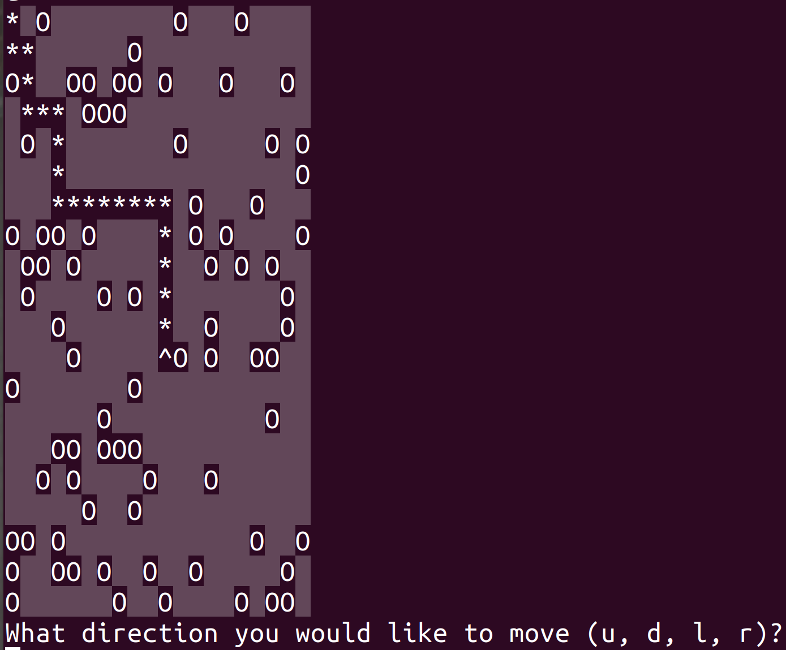

# JavaScript Interactive Game: Find Your Hat
An interactive terminal game in JavaScript and NodeJS.
The scenario is that the player has lost their hat in a field full of holes, 
and they must navigate back to it without falling down one of the holes or stepping outside of the field.


<!--ts-->
   * [JavaScript Interactive Game: Find Your Hat](#javascript-interactive-game-find-your-hat)
      * [Introduction](#introduction)
      * [Setup](#setup)
      * [Play the Game](#play-the-game)
         * [Try It Online with Gitpod!](#try-it-online-with-gitpod)

<!-- Added by: shiqi, at: Thu Dec 10 15:01:09 EST 2020 -->

<!--te-->

## Introduction
<p align="center">
  
</p>

You start at `*` position, your goal is to find your **hat** `^`. 
You can move up, down, left and right. But be careful, you must
not letting yourself dropping in to a **hole** (`o`). 

## Setup
- JavaScript
- Node.js
- Node modules. Two helpful one:
  * [prompt-synic](https://github.com/heapwolf/prompt-sync): simplifies the I/O operations. 
  * [terminal-kit](https://github.com/cronvel/terminal-kit): decorates your terminal color & styles. 

## Play the Game
In the terminal, type:
```
node main.js
```
Then follows the prompts and enjoy the game!

### Try It Online with Gitpod!
Click the icon bellow, it will bring you to a cloud based Dev environment. 

[](https://gitpod.io/#https://github.com/ShiqiHe000/Find_your_hat)

Run the code in the terminal:
```
node main.js
```

Enjoy!

